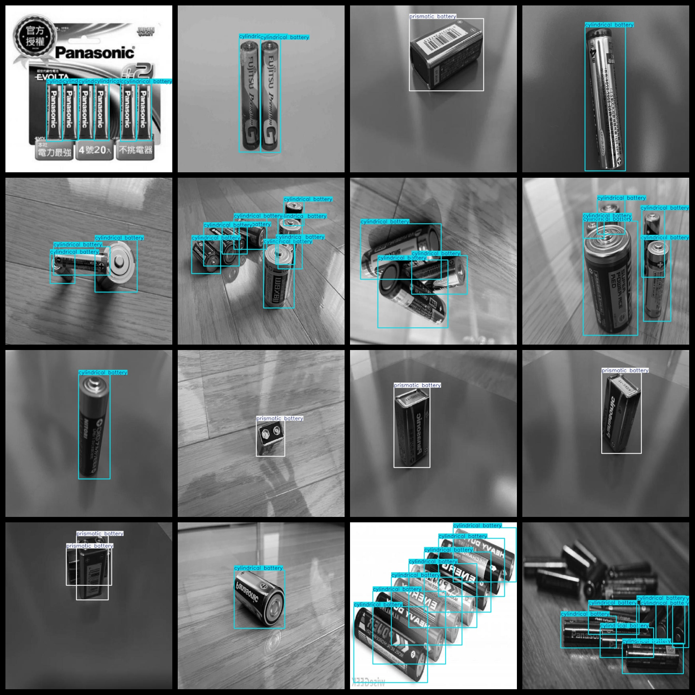
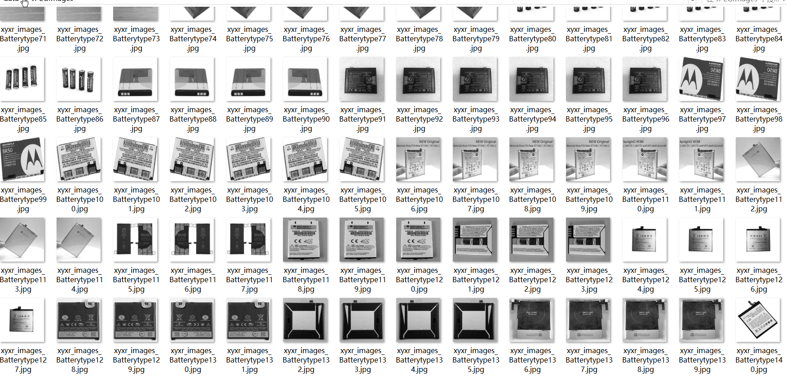

# Battery Type Recognition Dataset 4482 imagesVOC+YOLO format

Battery Type Identification Dataset 4482 sheets VOC + YOLO format

Dataset format: Pascal VOC format + YOLO format (the txt file does not contain the split path, it only contains jpg images and corresponding VOC format xml files and yolo format txt files)

Number of images (number of jpg files): 4482

Number of XML files: 4482

Number of annotations (number of txt files): 4482

Number of annotated categories: 3

The Github repository is: datasets_sl

["Pouch battery", "cylindrical battery", "prismatic battery"]

Soft-battery, Cylinder-battery, Prism-battery

Number of boxes labeled in each category:

The number of pouch batteries is 644.

Cylindrical battery has 7921 frames.

Pristine battery frame count = 1914

Total frames: 10479

Number of images per category:

Pouch battery has 479 images.

Cylindrical Battery occupies 2724 pictures = 2724

Prismatic battery occupies 1382 photos.

Image resolution: 640x640

Use the labeling tool: labelImg

Dataset Augmentation: Yes

Rules for annotation: Draw a rectangle around the category.

Important note: The dataset does not have been divided into training, validation, and testing sets.

Special Disclaimer: This dataset does not guarantee the accuracy of the trained models or weight files.

Annotation and image details are as follows:

## Images

---

Here is a pay link on Stripe (https://buy.stripe.com/3cs8yP7sY87d0vu9AB). Please contact me lonlonago@foxmail.com after funding $89, and I will send you a complete data files, thank you!

